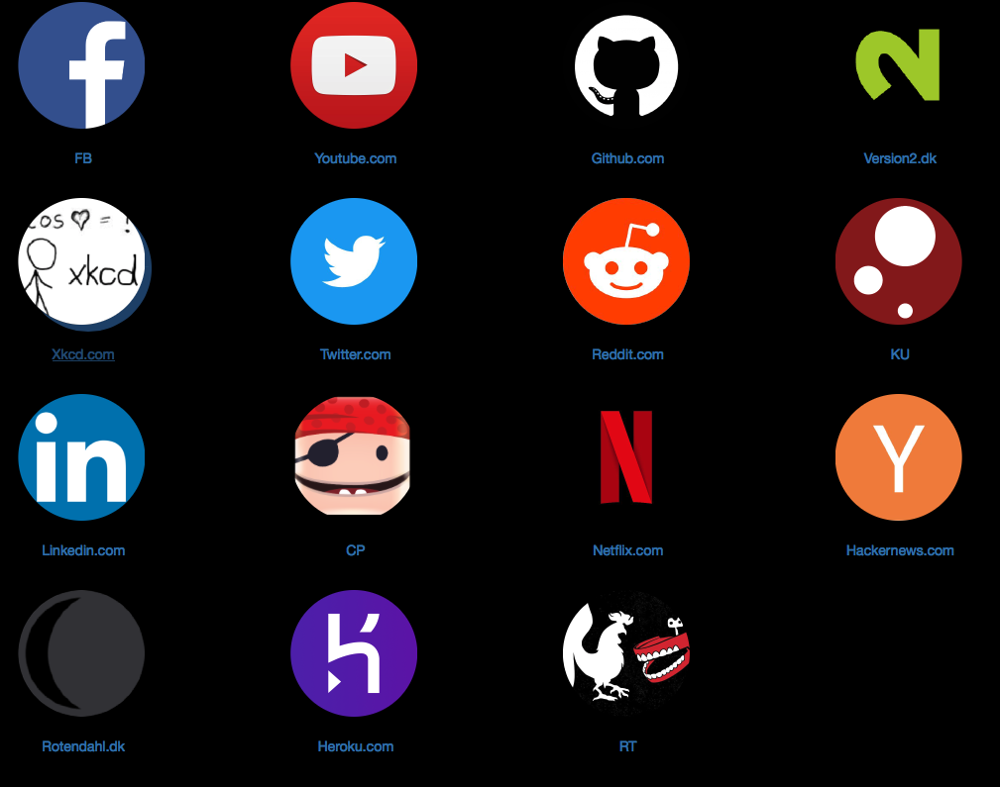

# Start page Generator

A small utility to generate responsive start pages for you phone, laptop, etc.
Most browsers offers a grid that shows you the pages you visit the most.

It's a useful feature but it has some problems.

* It does not sync between devices
* If you use different browsers at home and at work they look different.
* Hard to manage and get the right name and logo.

The utility is made in python 3, it uses the [jinja](http://jinja.pocoo.org)
template language, which can be installed with `pip3 install jinja`.

The links are specified in `links.txt` and has the following syntax.
`* Name -> url <- Logo`

The name and logo are optional, and are meant for sites where you want a shorter
name or a different logo. The logos are taken from
[clearbit.com/logo](https://clearbit.com/logo) if they don't have the logo it can be
manually specified. See the links file for examples

Once the links have bin specified you run `python generator.py` which produces
a file called `start.html` that contains your start page.

If you want a different color scheme change the CSS in template.html and run
the generator again.
